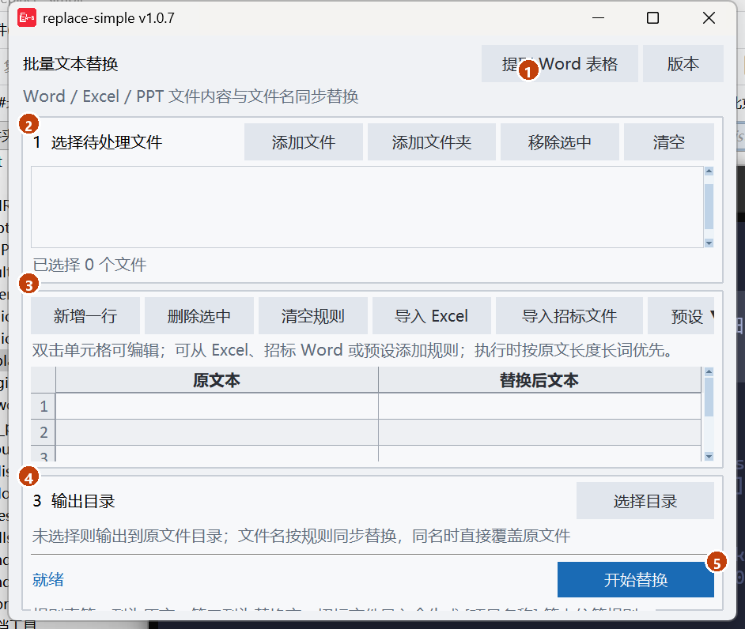
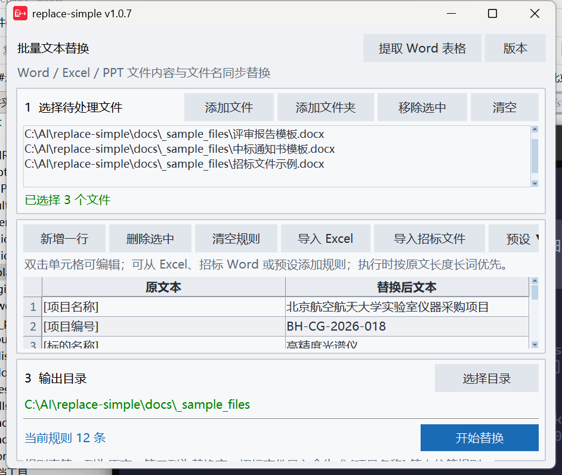
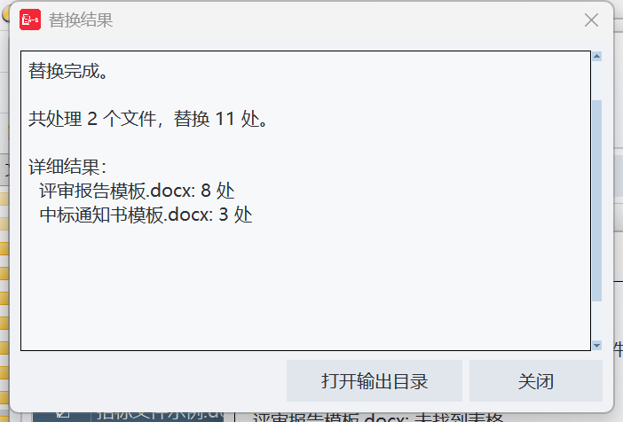
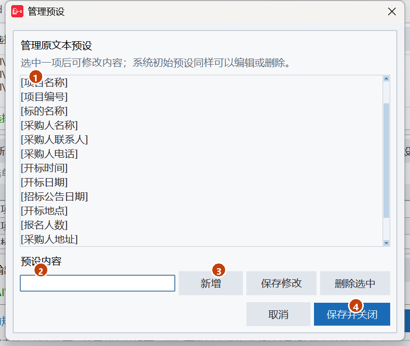
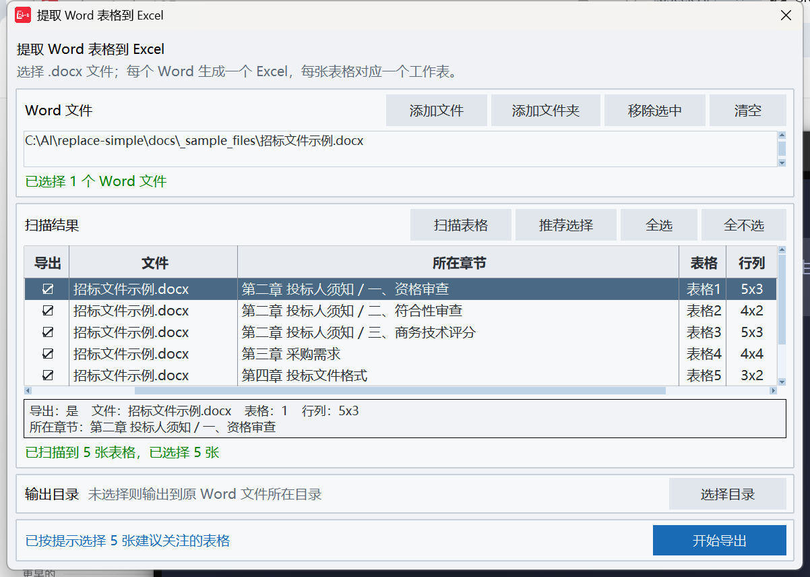
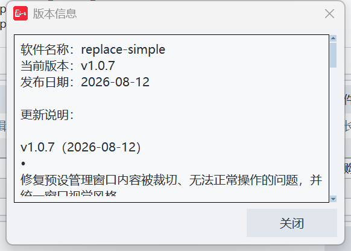

# replace-simple 使用教程

> 当前版本：**v1.0.7**（2026-08-12）  
> 适用系统：Windows 10 / 11 64 位  
> 适用对象：需要把同一套项目信息批量填进 Word / Excel / PPT 模板的招标代理、采购经办人

本文按软件真实界面逐项说明。文中截图来自 v1.0.7，示例文件在同目录 [`_sample_files/`](_sample_files/) 下，可直接打开软件跟着练。

---

## 目录

- [一、软件能做什么](#一软件能做什么)
- [二、安装与启动](#二安装与启动)
- [三、主界面一览](#三主界面一览)
- [四、批量文本替换](#四批量文本替换)
  - [第 1 步：选择待处理文件](#第-1-步选择待处理文件)
  - [第 2 步：编辑替换规则](#第-2-步编辑替换规则)
  - [第 3 步：指定输出目录并开始替换](#第-3-步指定输出目录并开始替换)
  - [查看替换结果](#查看替换结果)
- [五、从招标文件一键导入项目信息](#五从招标文件一键导入项目信息)
- [六、原文本预设](#六原文本预设)
- [七、提取信息](#七提取信息)
- [八、查看版本与更新说明](#八查看版本与更新说明)
- [九、程序会记住什么](#九程序会记住什么)
- [十、典型工作流](#十典型工作流)
- [十一、注意事项与常见问题](#十一注意事项与常见问题)

---

## 一、软件能做什么

replace-simple 是一款**离线桌面工具**，核心能力是：按你给出的「原文 → 替换文」规则，批量改写 Office 文件的**正文**和**文件名**。

另外还附带一个独立窗口，把 Word 正文里的表格抽成 Excel，方便后续做资格审查表、评分表等整理。

| 能力 | 说明 |
| --- | --- |
| 批量替换 | 支持 Word `.doc` / `.docx`、Excel `.xls` / `.xlsx` / `.xlsm`、PowerPoint `.ppt` / `.pptx` |
| 规则来源 | 界面手输、Excel 规则表、招标 Word 自动识别、原文本预设 |
| 文件名同步 | 文件名按同一套规则替换；Windows 禁用字符会自动改成全角，正文保持原样 |
| 提取表格 | 独立窗口扫描 `.doc` / `.docx` 正文表格，勾选后导出为 Excel，尽量保留合并单元格 |
| Office 依赖 | 新格式无需 Office；旧格式由本机 Microsoft Office 或兼容 WPS 处理 |

处理旧版 `.doc`、`.xls`、`.ppt` 时需要安装对应的 Microsoft Office 或兼容 WPS 组件；未安装时程序会提示先另存为新格式，不影响 `.docx`、`.xlsx`、`.xlsm`、`.pptx` 功能。

---

## 二、安装与启动

### 方式 A：直接运行绿色版（推荐）

1. 解压发布包 `replace-simple-v1.1.0-portable.zip`。
2. 进入 `replace-simple` 文件夹，双击 `replace-simple.exe`。

> **首次运行提示**  
> 未签名程序在新电脑上可能被 SmartScreen 拦截，选择「更多信息 → 仍要运行」即可。  
> 若 zip 是从网络下载的，请先右键 zip → **属性** → 勾选 **解除锁定**，再解压，避免 Windows 把整个目录标成不可信。

建议解压到桌面、文档等普通本地目录，不要放在过深的路径、网络盘或系统保护目录。

### 方式 B：从源码运行

```bash
pip install -r requirements.txt
python main.py
```

窗口标题栏会显示 `replace-simple v1.0.7`，确认版本与本文一致即可。

---

## 三、主界面一览

启动后是一个浅色主窗口，从上到下分成五个区域：



*图 1　主界面。① 右上角独立工具　② 选择待处理文件　③ 编辑替换规则　④ 输出目录　⑤ 开始替换*

| 编号 | 区域 | 做什么 |
| --- | --- | --- |
| ① | 右上角 | **提取信息**打开独立工具（提取 Word 表格、带符号指标参数等）；**版本**查看当前版本和更新说明 |
| ② | 第 1 步 | 添加要被替换的 Word / Excel / PPT |
| ③ | 第 2 步 | 编辑「原文本 / 替换后文本」对照表 |
| ④ | 第 3 步 | 指定结果保存到哪里；不选则写回原文件所在目录 |
| ⑤ | 主按钮 | 蓝色 **开始替换**，确认无误后点这里执行 |

填好文件和规则后的工作状态如下：



*图 2　已添加 3 个模板文件、12 条项目信息规则，并指定了输出目录*

底部左侧是状态文字：空闲时显示「就绪」或「当前规则 N 条」；处理过程中会变成进度说明，并出现进度条。

---

## 四、批量文本替换

整件事情可以记成三步：**选文件 → 写规则 → 点开始替换**。


### 第 1 步：选择待处理文件

对应主界面「**1  选择待处理文件**」。

#### 添加文件

1. 点击 **添加文件**。
2. 在打开的对话框中可一次多选。筛选器默认是「Office 文件」，也可以只看 Word / Excel / PPT。
3. 选中后点「打开」。列表里会出现完整路径，下方绿色字显示「已选择 N 个文件」。

支持的扩展名：

| 类型 | 扩展名 | 会替换哪里 |
| --- | --- | --- |
| Word | `.doc`、`.docx` | 正文段落、表格、页眉页脚等文字 |
| Excel | `.xls`、`.xlsx`、`.xlsm` | 所有工作表中的文本和普通数值单元格；公式不改 |
| PowerPoint | `.ppt`、`.pptx` | 文本框、表格、组合图形和备注页里的文字 |

程序会自动跳过：

- Office 打开文件时产生的临时文件（文件名以 `~$` 开头）
- 已经在列表里的同一文件（按真实路径去重，不会加两遍）
- 不支持的格式

#### 添加文件夹

1. 点击 **添加文件夹**。
2. 选一个目录。程序会在后台**递归扫描**该目录及所有子目录。
3. 扫描过程中状态栏会显示「正在扫描文件夹：已检查 N 个文件…」。
4. 找到支持的 Office 文件后自动加入列表；一个都没有则弹出提示。

大文件夹扫描不会卡住窗口，可以等进度结束。

#### 移除与清空

| 按钮 | 作用 |
| --- | --- |
| **移除选中** | 在列表中单击或 Ctrl / Shift 多选后删除 |
| **清空** | 一次去掉全部待处理文件 |

> **提示**  
> 待处理文件列表**不会**在关闭软件后保留。下次打开需要重新添加。  
> 从 Excel 或招标文件导入规则时，如果这个源文件也在待处理列表里，程序会自动把它移走，避免把规则表/招标原文一起替换掉。

---

### 第 2 步：编辑替换规则

对应规则区。规则表是两列电子表格：

| 列 | 含义 | 要求 |
| --- | --- | --- |
| **原文本** | 要被找到并换掉的字符串 | 不能为空；空行会被忽略 |
| **替换后文本** | 换成什么 | 可以为空（效果是删除原文） |

#### 手动录入

1. **双击**单元格进入编辑，输入后按 `Enter` 确认，`Esc` 取消。
2. 需要更多空行时点 **新增一行**，新行会出现在表尾并自动选中。
3. 点选一行或多行后，点 **删除选中** 去掉它们。
4. **清空规则** 会把整张表恢复成 4 行空白。

也可以像 Excel 一样操作：

| 操作 | 快捷键 / 手势 |
| --- | --- |
| 复制 | `Ctrl + C` |
| 粘贴 | `Ctrl + V`（可往下扩展行数，不会增加第三列） |
| 删除单元格内容 | `Delete` |
| 撤销 | `Ctrl + Z` |
| 多选 | 拖动，或 `Ctrl` 单击 |
| 调整列宽 / 行高 | 拖动表头或行号边界 |

底部状态会实时显示「当前规则 N 条」。只有「原文本」非空的行才计入。

#### 规则怎样生效

执行时程序会按下面几条处理，建议先看完再大批量跑：

1. **精确匹配**，不是正则、也不是通配符。`[项目名称]` 只会替换这六个字完全一样的地方。
2. **长词优先**。例如同时有 `北京航空航天大学` 和 `北京` 两条规则，会先替换更长的那条，避免短词把长词拆碎。
3. **完全相同的规则对会去重**。两行都是 `A → B`，只执行一次。
4. **防止叠床架屋**。如果替换结果里已经包含原文（例如 `A` → `A采购`），不会再对刚写进去的 `A` 做第二次替换。
5. **文件名同步替换**，但扩展名不变。`[项目名称]评标报告.docx` 会变成 `北京航空航天大学实验室仪器采购项目评标报告.docx`。
6. **文件名里的 Windows 禁用字符** `< > : " / \ | ? *` 以及控制字符，只在**文件名**里改成对应全角字符；**正文保持原样**。例如项目编号 `BH/2026` 写进正文仍是斜杠，写进文件名会变成 `BH／2026`。

> **建议写法**  
> 模板里请使用带方括号的占位符，例如 `[项目名称]`、`[项目编号]`。这样既不会误伤正文里的普通词，也和「导入招标文件」「预设」完全对得上。

#### 从 Excel 导入规则

适合已经有一份对照表、或要从上一项目复用规则的情况。

1. 点击 **导入 Excel**。
2. 选择 `.xlsx` / `.xlsm` / `.xls`。
3. 程序在后台读取**第一张工作表的前两列**：

| 原文本（第 1 列） | 替换后文本（第 2 列） |
| --- | --- |
| `[项目名称]` | 北京航空航天大学实验室仪器采购项目 |
| `[项目编号]` | BH-CG-2026-018 |
| `[采购人名称]` | 北京航空航天大学 |

教程附带的示例：[`_sample_files/替换规则表示例.xlsx`](_sample_files/替换规则表示例.xlsx)。

读取规则：

- 第 1 列空的行会被跳过。
- 完全相同的两列组合只保留第一次出现的。
- 数字会按文本读入；整数形式的小数（如 `5.0`）会收成 `5`。
- 导入成功后**整表替换**为 Excel 中的规则，不是追加。
- 如果这份 Excel 也在「待处理文件」里，会自动从列表移除。

规则表为空时会提示检查文件。

---

### 第 3 步：指定输出目录并开始替换

#### 输出目录

点击 **选择目录** 指定结果放哪里。路径会变成绿色。

- **不选**：输出到各源文件自己所在的目录。
- **选了**：所有结果都写到这个目录（不存在会自动创建）。
- 已加入待处理列表的文件即使没有匹配任何内容也会输出；零字节文件不解析，直接原样输出。

文件名冲突时的规则：

| 情况 | 结果 |
| --- | --- |
| 替换后的文件名和源文件相同 | **直接覆盖源文件**，不再生成「_已替换」副本 |
| 目标路径已经被**另一个**文件占用 | 自动加 `_1`、`_2`…，避免误覆盖无关文件 |
| 本批任务里两个文件会写成同一个名字 | 同样追加 `_1`、`_2`，保证本批互不覆盖 |

#### 开始替换

1. 确认列表里至少有 1 个文件、规则表至少有 1 条有效规则。
2. 点击蓝色 **开始替换**。
3. 缺文件或缺规则时会弹出警告，不会开始。
4. 开始后按钮区会暂时禁用，进度条显示「正在处理 (2/5)：某某.docx」。
5. 此时不要关窗口。任务进行中关闭会被拦住，提示等完成后再关。

处理过程中用的是**开始那一瞬间**冻结下来的文件列表、规则和输出目录。中途再改界面不会影响这一批。

### 查看替换结果

完成后弹出「替换结果」窗口：



*图 3　替换结果。可直接打开输出目录核对文件*

窗口里会列出：

- 共处理几个文件、合计替换几处
- 每个文件各自替换了几处
- 若有失败文件，会单独列出原因（最常见是文件正被 Word / Excel 打开，提示先关闭再试）

两个按钮：

| 按钮 | 作用 |
| --- | --- |
| **打开输出目录** | 用资源管理器打开本次结果所在文件夹 |
| **关闭** | 关掉结果窗口，回到主界面继续下一批 |

> **「替换 0 处」不一定是失败**  
> 表示这个文件里找不到任何原文。请检查占位符是否完全一致（多一个空格、少一对方括号都不会中）。

---

## 五、从招标文件一键导入项目信息

招标文件里已经写好了项目名称、编号、采购人、开标时间等字段。不必手抄，点 **导入招标文件** 即可抽成规则。

### 操作步骤

1. 点击规则区的 **导入招标文件**。
2. 选择一份招标 `.doc` 或 `.docx`；旧版 `.doc` 需要 Microsoft Word 或兼容 WPS Writer。
   - 若主界面或「提取信息」窗口里**只有 1 个 Word**，会直接用它。
   - 若检测到多个 Word，会提示你先在列表里选中一份，或在随后的对话框里重新选。
3. 等待状态栏「正在读取招标文件项目信息…」。
4. 识别到的字段会**整表写入**规则区：左列是占位符，右列是抽到的值；没抽到的字段右列留空，方便手补。

示例招标文件：[`_sample_files/招标文件示例.docx`](_sample_files/招标文件示例.docx)。

### 会生成哪些占位符

程序按固定顺序生成下面 12 条（与内置预设一致）：

| 占位符 | 识别来源（常见写法） |
| --- | --- |
| `[项目名称]` | 项目名称、采购项目名称、招标项目名称 |
| `[项目编号]` | 项目编号、采购项目编号、招标编号、采购编号 |
| `[标的名称]` | 标的名称、采购标的名称；表格里该列的多个值会用 `；` 拼在一起 |
| `[采购人名称]` | 采购人名称 / 采购人 / 招标人 / 建设单位 等 |
| `[采购人联系人]` | 采购人联系人、采购联系人；也能从「张老师，010-xxxx」里拆出姓名 |
| `[采购人电话]` | 采购人电话、联系电话、联系方式 |
| `[开标时间]` | 投标截止时间、开标时间、提交投标文件截止时间等；会去掉「（北京时间）」 |
| `[开标日期]` | 开标日期；若只有开标时间，会从中抽出 `YYYY年M月D日` |
| `[招标公告日期]` | 优先取第一章末尾、第二章之前最后一处日期（公告落款） |
| `[开标地点]` | 开标地点、开启地点；开标时间地点小节里的「地点」 |
| `[报名人数]` | 招标文件里通常没有，右列会空着等你手填 |
| `[采购人地址]` | 采购人地址、采购人联系地址、采购单位地址 |

识别范围包括：正文段落、表格（含单元格内嵌套表）、页眉页脚。采购人信息会优先从「采购人信息」小节读取，避免误用代理机构的联系人。

> **未识别不等于失败**  
> 右列空白的占位符仍会留下。补上即可。如果整份文件一个字段都没读到，会弹出说明。

导入用的招标文件如果也在待处理列表里，会自动移除，避免把招标原文本身替换掉。

---

## 六、原文本预设

不想每次手打 `[项目名称]` 时，用右上角 **预设 ▼**。

### 添加预设到规则表

点击 **预设 ▼**，在按钮下方弹出多选面板：


*图 4　预设面板。① 标题与已选计数　② 勾选一项或多项　③ 管理预设　④ 添加所选*

1. 单击一行即可勾选 / 取消，选中项显示蓝色对号。右上角「已选 N 项」会跟着变。
2. 列表可用鼠标滚轮滚动。
3. 点 **添加所选**：
   - 只把**规则表里还不存在**的原文本追加到表尾，替换列为空，等你填。
   - 已经有的占位符会自动跳过，不会重复。
   - 状态栏类似：「已从预设添加 3 条原文本规则；跳过 9 条已存在规则」。
4. 点 **取消** 或再点一次 **预设 ▼**、按 `Esc`，关闭面板。

### 管理预设

在预设面板点 **管理预设…**，打开独立窗口：



*图 5　管理预设。① 当前预设列表　② 编辑框　③ 新增 / 保存修改 / 删除　④ 保存并关闭*

| 操作 | 做法 |
| --- | --- |
| 新增 | 在「预设内容」里输入，点 **新增**，或在未选中列表项时按 `Enter` |
| 重命名 | 选中一项，改编辑框，点 **保存修改**（或按 `Enter`） |
| 删除 | 选中后点 **删除选中** |
| 保存 | 点 **保存并关闭** 才会写入设置；**取消** 丢弃本次改动 |

说明：

- 初始自带的 12 个项目字段**也可以改名或删掉**。
- 空内容和重复内容会被拒绝。
- 预设保存在当前 Windows 用户下，下次启动仍在。
- 这里改的是「快捷原文本清单」，不会自动改已经写在规则表里的行。

---

## 七、提取信息

评标时经常要把招标文件里的资格审查表、符合性审查表、评分表、采购需求表抽到 Excel，或把 ★ ▲ 等带符号的指标条款整理成表。点主界面右上角 **提取信息**。


### 窗口说明

打开后会尽量把主界面里已经选过的 Word **自动带入**。窗口支持最大化；默认高度也已加大，使扫描列表和下方明细预览能同时显示更多内容。



*图 6　已扫描招标文件中的 5 张表，并按提示勾选了建议关注的表格*

窗口分五块：

| 区域 | 作用 |
| --- | --- |
| Word 文件 | 添加 / 移除 `.doc`、`.docx`，只接受 Word |
| 扫描结果 | 同时列出表格和按实际章节汇总的符号条款，勾选要导出的项目 |
| 明细栏 | 单击一行后，显示完整章节以及表格或符号条款预览 |
| 符号扫描设置 | 设置本次扫描识别的符号，以及导出正文中是否保留符号 |
| 输出目录 + **开始导出** | 指定保存位置并执行 |

### 添加 Word

和主界面一样：**添加文件**、**添加文件夹**（只收 `.doc` / `.docx`）、**移除选中**、**清空**。
文件列表或扫描符号一变，上次的扫描结果会作废，需要重新点 **扫描表格和符号**。

### 扫描表格和符号

1. 至少添加 1 个 Word 后，点 **扫描表格和符号**。
2. 程序读取每个文档的正文表格，并用当前符号集扫描正文与表格中的带符号条款。
3. 带符号条款按“文件 + 实际完整章节路径”汇总；不同文件不需要使用相同章节名，未识别到标题的内容会归入“未识别章节”。
4. 扫描结果默认全部不选，列表各列含义如下：

| 列 | 含义 |
| --- | --- |
| **导出** | `☐` 未选 / `☑` 已选 |
| **文件** | 来源文件名 |
| **类型** | `表格` 或 `符号条款` |
| **所在章节** | 例如「第二章 投标人须知 / 一、资格审查」；识别不到则显示「未识别章节」 |
| **项目** | 表格行显示 `表格1`；符号行显示该章节发现的 `★ ▲` 等符号 |
| **数量** | 表格显示 `5x3` 等行列数；符号章节显示 `12条` 等条款数 |

六个表头都带有 `▼`。点击任一表头会打开下拉筛选框，可以直接点击多个值进行多选，也可以使用“全选、全不选、清除筛选”。正在生效的列会显示 `[筛]`；多个列的筛选条件会同时生效。

部分文件没有表格、没有带符号条款或读取失败时，会在「扫描结果」弹窗中分别说明。

### 怎样勾选

| 操作 | 效果 |
| --- | --- |
| 单击「导出」列的方框 | 切换这一项 |
| 双击整行 | 切换这一项 |
| 选中一行或多行后按 `空格` | 切换当前选中的行 |
| **推荐表格** | 对当前筛选显示的表格重选“建议关注”项；隐藏项和已选符号章节保持不变 |
| **筛选结果全选 / 筛选结果全不选** | 同一个按钮会按当前状态切换功能，一键勾选或取消当前筛选显示的全部项目；隐藏项目保持原选择 |

点表格行时，下方明细栏会给出完整提示和预览，例如：

```
导出：是    文件：招标文件示例.docx    表格：1    行列：5x3
所在章节：第二章 投标人须知 / 一、资格审查
提示：建议关注：资格审查（命中：资格审查）
表格前文：……
内容预览：序号 | 资格条件 | 证明材料 | ……
```

「提示」是根据章节名、前文和表内文字做的关键词判断，方便快速筛评审用表：

| 提示 | 通常对应 |
| --- | --- |
| 建议关注：资格审查 | 资格条件、资格性审查 |
| 建议关注：符合性审查 | 符合性审查、实质性响应 |
| 建议关注：评分/评审表 | 评分、分值、商务技术、综合评分 |
| 建议关注：采购需求/技术参数 | 采购需求、技术参数、服务要求 |
| 谨慎选择：可能是投标文件格式 | 投标函、授权委托、承诺函等格式表 |
| 谨慎选择：可能是合同/报价类 | 合同条款、开标一览表、分项报价 |
| 未命中常见评审关键词 | 请自己看章节和预览再决定 |

> **推荐表格不是强制**
>
> 「推荐表格」只是按关键词选择表格，不会替用户判断符号章节。图 6 的示例里，第 5 张「投标文件格式」也会被扫出来；如果提示是「谨慎选择」，评标整理时一般不要导出。

### 导出

1. 至少勾选 1 项扫描结果；可以只选表格、只选符号章节，也可以两者同时选择。
2. 需要的话点 **选择目录**；不选则每个 Excel 写到对应 Word 旁边。
3. 点蓝色 **开始导出**。

输出约定：

| 项目 | 规则 |
| --- | --- |
| 文件名 | `原文件名_表格.xlsx` |
| 已存在同名文件 | 自动变成 `_表格_1.xlsx`、`_表格_2.xlsx`，不覆盖 |
| 工作表 | 每个被勾选的表一张，名称为 `表格1`、`表格2`… |
| 单元格 | 文本格式、自动换行、细边框；尽量还原 Word 的合并单元格 |
| 列宽 | 按内容自动调整，中文按双倍宽度估算 |

完成后弹出「导出结果」，列出每个文件导出了几张表、保存路径；失败或跳过的也会写明原因。同样可以用 **打开输出目录** 立刻核对。

### 选择并提取带符号的指标参数

采购需求里的关键指标常用特殊符号标记，默认识别 `★`、`#`、`△`、`▲` 这 4 个符号。点击 **扫描表格和符号** 后，程序会把每个文件实际发现的符号章节列入扫描结果；选择需要的符号章节再点 **开始导出**。「自定义符号…」按钮可以增删扫描时要识别的符号。

章节选择按文件独立保存于本次扫描结果中。例如甲文件可以选择“第五章 采购需求”，乙文件可以选择“第三章 设备技术规范”，不需要预先维护一套固定章节关键词。只选择符号章节而不选择表格也可以正常导出。

#### 条款内容中保留符号

默认**不勾选**。Excel 已经有单独的「符号」列，不勾选时会把条款开头或序号后面的 `★`、`#`、`△`、`▲` 从正文里去掉，只留在符号列。若希望导出内容与招标文件原文完全一致（含符号），勾上即可。

句子中间出现的符号本来就不会当作条款标记，因此也不会被去掉。

#### 自定义符号

点 **自定义符号…** 打开对话框：

- 常用符号以勾选框列出，**默认 4 个符号已勾选，可以随时取消**；其他常用符号（`☆`、`▽`、`◆`、`●`、`■`、`※`、`◎`、`＊`、`＃` 等）勾选即生效。
- **其他符号**输入框里可以直接输入不在列表中的符号（如 `⊙`），多个符号连着写即可，会追加到勾选项。
- 数字、字母、汉字和空格会被自动忽略（会和条款序号识别冲突）。
- **恢复默认** 回到 `★ # △ ▲`；**确定** 后立即生效并保存，下次打开软件仍记住你的选择。符号有变化时需要重新扫描；**取消** 则放弃修改。
- 按钮旁边会显示「当前：★ # △ ▲」，即当前生效的符号集。

#### 提取规则

| 规则 | 说明 |
| --- | --- |
| 符号位置 | 条款最开头（如 `★支持夜视`）、条款序号之后（如 `3.2、▲支持H.265`），或同一行内分号/逗号后的下一条参数；句子中间出现的符号不算 |
| 符号范围 | 只识别「当前」显示的符号，其余符号不参与 |
| 正文条款 | 提取符号所在的**整个段落**，全文保留（是否保留符号由上面的选项决定） |
| 表格条款 | 以**符号条款块**分别提取；同行不含符号的序号、名称等公共上下文会保留，同一单元格内的其他符号条款不会混入 |
| 条款序号 | 纯文本编号直接保留；Word 自动编号会自动重建（如 `1.`、`1.一` 等多级编号）拼回条款前面 |
| 多符号条款 | 同一条款同时带多个符号时，每个符号单独一行；同一表格单元格内连续写有多条符号条款时，每条分别导出并保留自己的续行 |
| 提取范围 | 扫描全文并按每个文件检测到的完整章节路径汇总，最终只导出用户勾选的符号章节 |

输出约定：每个 Word 额外生成一个 `原文件名_指标参数.xlsx`，与 `_表格.xlsx` 互不影响。工作表名为「指标参数」，共 3 列：

| 列 | 内容 |
| --- | --- |
| 数量序号 | 提取出的条款流水号，1、2、3… |
| 符号 | 该行的标记符号（★、▲、△、# 等） |
| 详细内容（带序号） | 条款全文，包含条款序号 |

> **提示**：评标办法、投标文件格式等章节若重复引用带符号条款，也会显示为独立扫描项；不需要时保持不勾选即可。

任务进行中不能关这个窗口，也不能关主程序。

---

## 八、查看版本与更新说明

主界面右上角点 **版本**，在主窗口正中弹出：



*图 7　版本信息，含软件名、当前版本、发布日期和历次更新说明*

发版说明按版本倒序排列。遇到界面或行为与记忆不符时，先看这里确认是不是新版本改过。

也可以在资源管理器中右键 `replace-simple.exe` → **属性** → **详细信息**，核对文件版本。

---

## 九、程序会记住什么

正常关闭主窗口时，会把下列内容写到当前用户目录，下次启动自动恢复：

| 会记住 | 不会记住 |
| --- | --- |
| 窗口位置和大小 | 待处理文件列表 |
| 规则表内容 | 提取表格窗口里的文件和勾选 |
| 输出目录 | — |
| 自定义预设 | — |
| 指标参数的自定义扫描符号 | — |
| 条款内容中是否保留符号 | — |

设置文件位置：

```
%APPDATA%\replace-simple\settings.json
```

一般是 `C:\Users\<用户名>\AppData\Roaming\replace-simple\settings.json`。

出错时的日志：

```
%LOCALAPPDATA%\replace-simple\error.log
```

未捕获异常会弹窗，并写明上述日志路径，可以把该文件发给维护人员。

---

## 十、典型工作流

### 工作流 A：用招标文件给模板套项目信息

适合：评标报告、中标通知书、邮件稿等模板里已经写好 `[项目名称]` 一类占位符。

1. **添加文件**：把本项目要用的全部模板加进来（可一次加整个文件夹）。
2. **导入招标文件**：选本项目招标 `.doc` 或 `.docx`，12 个占位符会自动填好。
3. 扫一眼右列，空白的（常见是 `[报名人数]`）手补；识别不准的改一下。
4. 需要额外替换时（例如把「投标人」统一改成某公司名），**新增一行**。
5. **选择目录** 指到本项目成果文件夹（建议不要直接覆盖模板库）。
6. **开始替换** → 在结果窗口点 **打开输出目录** 抽查。

可以先用教程里的三个示例走一遍：

| 文件 | 用途 |
| --- | --- |
| [`招标文件示例.docx`](_sample_files/招标文件示例.docx) | 当作「导入招标文件」的来源 |
| [`评审报告模板.docx`](_sample_files/评审报告模板.docx) | 待替换模板 |
| [`中标通知书模板.docx`](_sample_files/中标通知书模板.docx) | 待替换模板 |
| [`替换规则表示例.xlsx`](_sample_files/替换规则表示例.xlsx) | 不想用招标导入时，改用 Excel 规则 |

### 工作流 B：规则已经在 Excel 里

1. 按两列整理好对照表（可参考上面的示例 xlsx）。
2. **导入 Excel**。
3. 添加待处理文件，开始替换。

### 工作流 C：从招标文件抽出评审用表

1. 主界面点 **提取信息**（或先把招标文件加到主列表，窗口会自动带入）。
2. **扫描表格和符号**。
3. 点 **推荐表格**，再对照明细栏选择需要的表格和符号章节。
4. **开始导出**，得到 `招标文件示例_表格.xlsx`，每张表一个工作表。

### 工作流 D：同一批模板换下一个项目

1. 不用清空规则。再次 **导入招标文件**，12 个占位符会被新项目的值整表覆盖。
2. 如有手工加的额外规则，导入后要重新加一遍（导入是整表替换，不是追加）。
3. 换一批模板文件，改输出目录，再点 **开始替换**。

---

## 十一、注意事项与常见问题

### 使用前请先做到

1. **关闭**正要处理的 Word / Excel / PPT。文件被占用时会提示「请先关闭正在打开的 Word/Excel/PPT 文件后重试」。
2. 重要模板先复制一份，或把输出目录指到新文件夹，避免第一次就覆盖源文件。
3. 先拿 1～2 个文件试跑，确认占位符和文件名都符合预期，再批量处理。

### 替换范围与限制

| 问 | 答 |
| --- | --- |
| 能改图片里的字吗？ | 不能。只改文本，不改嵌入对象、文本框绘图（Word 浮动文本框不在正文段落里时可能改不到）。 |
| Excel 公式会不会被改？ | 以 `=` 开头的单元格会跳过。 |
| 宏文件 `.xlsm` 还能用吗？ | 可以，会保留 VBA。 |
| 旧版 `.doc` / `.xls` / `.ppt` 行吗？ | 可以，但需要本机安装对应的 Microsoft Office 或兼容 WPS；程序保持原格式保存。 |
| 页眉页脚会换吗？ | Word 会。PPT 母版较复杂，以实际幻灯片形状为准。 |

### 文件名相关

- 只清理**输出文件名**，正文里的 `/`、`*` 等保持原样。
- 文件名替换后如果变成空的或只剩空格，会用 `_` 代替。
- `CON`、`PRN`、`NUL`、`COM1`、`LPT1` 等 Windows 保留名会自动加前缀 `_`。

### 界面与操作

| 现象 | 处理 |
| --- | --- |
| 点「开始替换」没反应，弹出「请先选择待处理文件」 | 先添加文件 |
| 弹出「请先新增或导入至少一条替换规则」 | 原文本列不能全空 |
| 导入招标后规则变少了 / 手工行没了 | 导入是整表覆盖，先导出或抄下额外规则再导 |
| 「删除选中」没删掉正在编辑的那一行 | 先结束编辑（回车），再点该行后删除 |
| 关不掉软件 | 替换或导出还在跑，等进度条结束 |
| 提取表格窗口是空的 | 主界面还没加过 Word；在该窗口里自己添加即可 |

### 运行与排错

| 现象 | 处理 |
| --- | --- |
| SmartScreen 拦截 | 「更多信息 → 仍要运行」；长期使用可考虑代码签名 |
| 解压后双击没反应 / 被拦截 | 先给 zip「解除锁定」再解压 |
| 程序弹出「程序出错」 | 打开 `%LOCALAPPDATA%\replace-simple\error.log`，连同操作步骤发给维护人员 |
| 高分屏界面偏小或偏大 | 软件已做 DPI 感知；可把窗口拖大，规则表高度会跟着剩下来的空间变 |

### 和评标现场有关的提醒

- 本工具做的是**字面替换**，不会理解条款含义。替换后仍需抽查关键页。
- 「提取信息」窗口的「推荐表格」只是关键词提示，资格审查表、评分表和符号章节是否导出，以招标文件内容为准。
- 不要把招标原文和模板放在同一批里替换——导入招标时程序会尽量把源文件移出列表，但仍建议模板单独放一个文件夹。

---

## 附录：界面按钮速查

### 主窗口

| 位置 | 按钮 | 作用 |
| --- | --- | --- |
| 右上角 | 提取信息 | 打开表格导出窗口（含带符号指标参数提取） |
| 右上角 | 版本 | 查看版本与更新说明 |
| 文件区 | 添加文件 | 多选 Office 文件 |
| 文件区 | 添加文件夹 | 递归扫描目录 |
| 文件区 | 移除选中 | 从列表去掉选中项 |
| 文件区 | 清空 | 清空待处理列表 |
| 规则区 | 新增一行 | 表尾加一行空白规则 |
| 规则区 | 删除选中 | 删除选中规则行 |
| 规则区 | 清空规则 | 恢复 4 行空表 |
| 规则区 | 导入 Excel | 用 Excel 前两列整表覆盖规则 |
| 规则区 | 导入招标文件 | 从招标 Word 生成 12 条占位符规则 |
| 规则区 | 预设 ▼ | 多选内置/自定义原文本并追加 |
| 输出区 | 选择目录 | 指定输出文件夹 |
| 底部 | 开始替换 | 按当前规则批量处理 |

### 提取信息窗口

| 按钮 | 作用 |
| --- | --- |
| 添加文件 / 添加文件夹 / 移除选中 / 清空 | 管理 Word 列表 |
| 扫描表格和符号 | 读取正文表格，并按每个文件的实际章节汇总带符号条款 |
| 各列表头 `▼` | 打开下拉多选筛选；生效时显示 `[筛]` |
| 推荐表格 | 勾选「建议关注」的表，保留已选符号章节 |
| 筛选结果全选 / 全不选 | 一个双状态按钮，切换当前筛选显示项目的勾选状态 |
| 选择目录 | 指定 Excel 输出位置 |
| 开始导出 | 按勾选结果写出 xlsx |

---

*文档对应软件版本 v1.1.0。界面改版后请以软件内「版本」窗口为准。*
